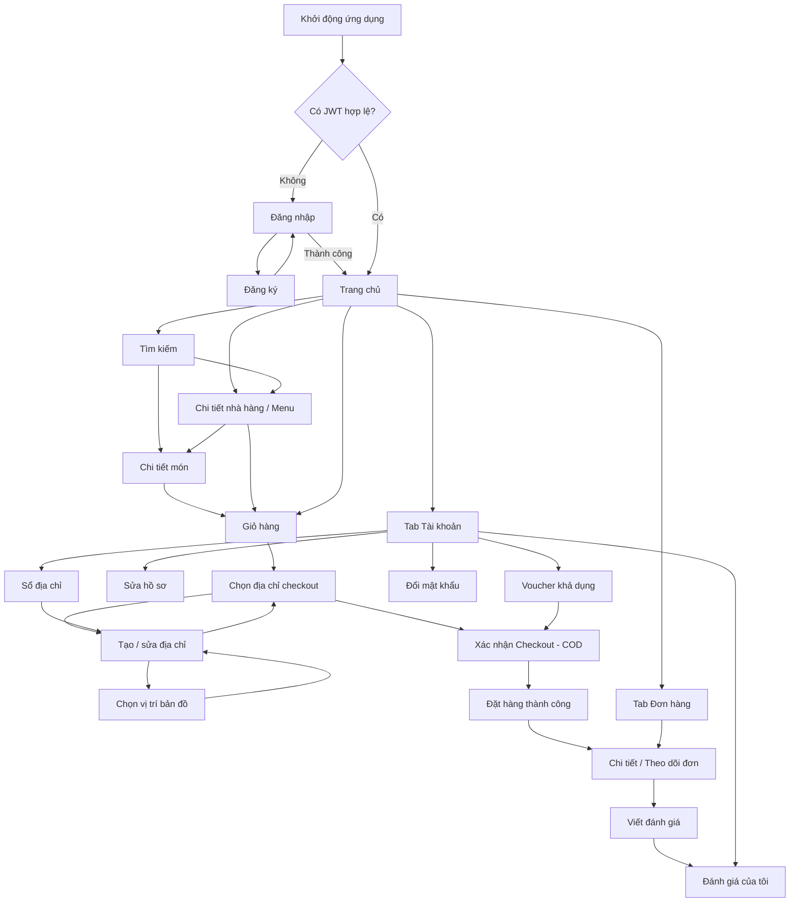

Mình sẽ đối chiếu yêu cầu nghiệp vụ, API, ngữ cảnh ứng dụng và schema để lập danh sách màn hình cùng mapping dữ liệu/API nhất quán; sau đó tổng hợp luồng điều hướng và đặc tả bằng tiếng Việt.

Search for `^#{1,4} `

Search for `^#{1,4} `

Search for `^#{1,4} `

Search for `CREATE TABLE|CREATE VIEW|CREATE PROCEDURE|CREATE FUNCTION|CREATE TRIGGER|--`

Read , lines 1 to 260
Completed with input: {
"path": "C:\\Users\\Dell\\Desktop\\Mobile Đa Nền Tảng\\Food Delivery App\\fooddeliveryapp_customer\\BUSINESS_REQUIREMENTS.md",
"view_range": [
1,
260
]
}

Read , lines 1 to 260
Completed with input: {
"path": "C:\\Users\\Dell\\Desktop\\Mobile Đa Nền Tảng\\Food Delivery App\\fooddeliveryapp_customer\\AI_Context_FoodDeliveryApp.md",
"view_range": [
1,
260
]
}

Read , lines 1 to 710
Completed with input: {
"path": "C:\\Users\\Dell\\Desktop\\Mobile Đa Nền Tảng\\Food Delivery App\\fooddeliveryapp_customer\\API_ENDPOINTS_DOCUMENTATION.md",
"view_range": [
1,
710
]
}

Read , lines 70 to 390
Completed with input: {
"path": "C:\\Users\\Dell\\Desktop\\Mobile Đa Nền Tảng\\Food Delivery App\\fooddeliveryapp_backend\\DB_Script_FoodDeliveryApp.sql",
"view_range": [
70,
390
]
}

Search for `4\.[0-9]|5\.|Customer|Order Status|Status|Review|Voucher|Address|Cart|Checkou...`

Search for `Expo|React Native|Customer App|screen|Screen|route|navigation|UI|UX|COD|GPS|C...`

Read , lines 250 to 690
Completed with input: {
"path": "C:\\Users\\Dell\\Desktop\\Mobile Đa Nền Tảng\\Food Delivery App\\fooddeliveryapp_customer\\API_ENDPOINTS_DOCUMENTATION.md",
"view_range": [
250,
690
]
}

Read , lines 259 to 390
Completed with input: {
"path": "C:\\Users\\Dell\\Desktop\\Mobile Đa Nền Tảng\\Food Delivery App\\fooddeliveryapp_backend\\DB_Script_FoodDeliveryApp.sql",
"view_range": [
259,
390
]
}

Read , lines 230 to 490
Completed with input: {
"path": "C:\\Users\\Dell\\Desktop\\Mobile Đa Nền Tảng\\Food Delivery App\\fooddeliveryapp_customer\\BUSINESS_REQUIREMENTS.md",
"view_range": [
230,
490
]
}

Read , lines 550 to 710
Completed with input: {
"path": "C:\\Users\\Dell\\Desktop\\Mobile Đa Nền Tảng\\Food Delivery App\\fooddeliveryapp_customer\\API_ENDPOINTS_DOCUMENTATION.md",
"view_range": [
550,
710
]
}

Read , lines 1250 to 1280
Completed with input: {
"path": "C:\\Users\\Dell\\Desktop\\Mobile Đa Nền Tảng\\Food Delivery App\\fooddeliveryapp_customer\\API_ENDPOINTS_DOCUMENTATION.md",
"view_range": [
1250,
1280
]
}

Read , lines 1 to 70
Completed with input: {
"path": "C:\\Users\\Dell\\Desktop\\Mobile Đa Nền Tảng\\Food Delivery App\\fooddeliveryapp_backend\\DB_Script_FoodDeliveryApp.sql",
"view_range": [
1,
70
]
}

Các tài liệu thống nhất phạm vi MVP: chỉ COD, giỏ hàng mỗi lần thuộc một nhà hàng, theo dõi bằng trạng thái (không GPS realtime), đánh giá sau khi đơn hoàn tất. Mình đang chốt các response/field cụ thể và sẽ đánh dấu rõ những UI mong muốn nhưng backend hiện chưa có API hỗ trợ.

Read , lines 70 to 249
Completed with input: {
"path": "C:\\Users\\Dell\\Desktop\\Mobile Đa Nền Tảng\\Food Delivery App\\fooddeliveryapp_customer\\API_ENDPOINTS_DOCUMENTATION.md",
"view_range": [
70,
249
]
}

Read , lines 480 to 740
Completed with input: {
"path": "C:\\Users\\Dell\\Desktop\\Mobile Đa Nền Tảng\\Food Delivery App\\fooddeliveryapp_customer\\BUSINESS_REQUIREMENTS.md",
"view_range": [
480,
740
]
}

Read , lines 690 to 708
Completed with input: {
"path": "C:\\Users\\Dell\\Desktop\\Mobile Đa Nền Tảng\\Food Delivery App\\fooddeliveryapp_customer\\API_ENDPOINTS_DOCUMENTATION.md",
"view_range": [
690,
708
]
}

Read , lines 390 to 445
Completed with input: {
"path": "C:\\Users\\Dell\\Desktop\\Mobile Đa Nền Tảng\\Food Delivery App\\fooddeliveryapp_backend\\DB_Script_FoodDeliveryApp.sql",
"view_range": [
390,
445
]
}

# Đề xuất thiết kế Customer App bằng Expo

## Cơ sở và phạm vi

Phân tích này đối chiếu `BUSINESS_REQUIREMENTS.md`, `API_ENDPOINTS_DOCUMENTATION.md`, `AI_Context_FoodDeliveryApp.md` và `DB_Script_FoodDeliveryApp.sql`.

Các nguyên tắc ảnh hưởng trực tiếp đến UI:

- Thanh toán **COD בלבד**; không thiết kế luồng thanh toán trực tuyến.
- Một giỏ hàng chỉ chứa món từ **một nhà hàng**. Khi thêm món từ nhà hàng khác, cần hỏi khách có muốn xóa giỏ hiện tại không.
- Theo dõi tiến độ bằng **trạng thái đơn hàng và lịch sử trạng thái**, không hiển thị bản đồ hoặc vị trí shipper realtime.
- Chỉ đánh giá đơn `COMPLETED`, tối đa một đánh giá mỗi đơn.
- Dữ liệu catalog yêu cầu xác thực theo tài liệu API; màn hình khám phá cần đăng nhập trước khi tải danh sách.
- Không có API tìm kiếm/lọc theo “món bán chạy”, yêu thích, thông báo đẩy hoặc khôi phục mật khẩu. API `POST /api/orders/quote` hỗ trợ xem trước checkout.

## 1. Số lượng và danh sách màn hình

Đề xuất **22 màn hình/route**. Một số form tái sử dụng chung giao diện nhưng được liệt kê riêng khi có đường dẫn hoặc cách điều hướng khác nhau.

| Nhóm      | Route Expo Router                | Màn hình                        |
| --------- | -------------------------------- | ------------------------------- |
| Auth      | `/(auth)/login`                  | Đăng nhập                       |
| Auth      | `/(auth)/register`               | Đăng ký                         |
| Main Tabs | `/(tabs)/home`                   | Khám phá                        |
| Main Tabs | `/(tabs)/orders`                 | Đơn hàng của tôi                |
| Main Tabs | `/(tabs)/cart`                   | Giỏ hàng                        |
| Main Tabs | `/(tabs)/account`                | Tài khoản                       |
| Khám phá  | `/search`                        | Tìm nhà hàng/món ăn             |
| Khám phá  | `/restaurants/[restaurantId]`    | Chi tiết nhà hàng và menu       |
| Khám phá  | `/foods/[foodId]`                | Chi tiết món                    |
| Checkout  | `/checkout/address`              | Chọn địa chỉ giao hàng          |
| Checkout  | `/checkout`                      | Xác nhận checkout               |
| Checkout  | `/checkout/success/[orderId]`    | Đặt hàng thành công             |
| Đơn hàng  | `/orders/[orderId]`              | Chi tiết và theo dõi trạng thái |
| Đơn hàng  | `/orders/[orderId]/review`       | Viết đánh giá                   |
| Tài khoản | `/profile/edit`                  | Cập nhật hồ sơ                  |
| Tài khoản | `/profile/addresses`             | Sổ địa chỉ                      |
| Tài khoản | `/profile/addresses/new`         | Thêm địa chỉ                    |
| Tài khoản | `/profile/addresses/[addressId]` | Sửa địa chỉ                     |
| Tài khoản | `/profile/addresses/map-picker`  | Chọn vị trí trên bản đồ         |
| Tài khoản | `/profile/change-password`       | Đổi mật khẩu                    |
| Tài khoản | `/reviews`                       | Đánh giá của tôi                |
| Tài khoản | `/vouchers`                      | Voucher khả dụng                |

**Không tính vào 22 màn hình:** màn hình splash/khởi tạo ứng dụng, modal xác nhận xóa giỏ, modal chọn số lượng món, modal áp dụng voucher và các trạng thái loading/empty/error. Đây là các thành phần hoặc trạng thái của màn hình hiện hữu.

## 2. Đặc tả chi tiết từng màn hình

### A. Auth Flow

#### 1. Đăng nhập — `/(auth)/login`

- **Cần hiển thị:** email, mật khẩu, lỗi xác thực; loading khi gửi yêu cầu.
- **Nên hiển thị:** nút hiện/ẩn mật khẩu, validation ngay trên form, CTA đăng ký.
- **UI:** logo/brand, hai input, nút đăng nhập, liên kết đăng ký.
- **Tương tác/API:** gửi `POST /api/auth/login` với `{email, password}`. Khi thành công, chỉ cho vào Customer App nếu `role === CUSTOMER`; lưu token an toàn trên thiết bị. Gọi `GET /api/auth/me` để tải hồ sơ khi cần.
- **Dữ liệu:** `users.email`, `users.status_id`; hồ sơ Customer gồm `customer_profiles.full_name`, `phone`, `date_of_birth`. Không bao giờ đọc/lưu `password_hash`.
- **Lưu ý:** token có thời hạn 3600 giây theo tài liệu API. Logout phía backend chỉ xác nhận thao tác; phía app phải chủ động xóa token.

#### 2. Đăng ký — `/(auth)/register`

- **Cần hiển thị:** họ tên, email, số điện thoại, mật khẩu, ngày sinh tùy chọn.
- **Nên hiển thị:** quy tắc mật khẩu và định dạng điện thoại; xác nhận mật khẩu ở client; cảnh báo email/số điện thoại đã tồn tại.
- **UI:** form cuộn, input có nhãn, nút tạo tài khoản, liên kết về đăng nhập.
- **Tương tác/API:** `POST /api/auth/register` với `email`, `password`, `fullName`, `phone`, `dateOfBirth` tùy chọn. Với thành công `201`, chuyển sang đăng nhập nếu response không cấp token.
- **Dữ liệu:** tạo `users`, `customers`, `customer_profiles`.
- **Validation theo API:** email tối đa 150 ký tự; mật khẩu 8–72 byte UTF-8; họ tên tối đa 100; điện thoại 8–15 chữ số, có thể có tiền tố `+`; ngày sinh theo `YYYY-MM-DD`.
- **Không đưa vào MVP:** “Quên mật khẩu”/OTP vì tài liệu API không có endpoint khôi phục mật khẩu.

### B. Main Tabs và khám phá

#### 3. Khám phá — `/(tabs)/home`

- **Cần hiển thị:** vị trí/địa chỉ đang chọn nếu có, ô tìm kiếm, danh mục, danh sách nhà hàng đang hoạt động; tên, ảnh, địa chỉ, trạng thái mở cửa, thời gian mở cửa và rating nếu có.
- **Nên hiển thị:** banner giới thiệu tĩnh hoặc nội dung do ứng dụng cấu hình; hàng danh mục cuộn ngang; nhãn “Đang mở”; khoảng cách khi người dùng cấp quyền vị trí.
- **UI:** header địa chỉ, search bar, chips danh mục, danh sách nhà hàng dạng card; tab bar cố định.
- **Tương tác/API:** `GET /# Thiết kế Customer App bằng Expo — đề xuất MVP

Đối chiếu tài liệu nghiệp vụ, API và database cho thấy ứng dụng cần phục vụ trọn hành trình: đăng nhập → khám phá nhà hàng/món ăn → giỏ hàng → checkout COD → theo dõi trạng thái → đánh giá. MVP **không** có thanh toán online, GPS shipper realtime, chat, khôi phục mật khẩu hay API gợi ý cá nhân hóa.

## 1. Số lượng và danh sách màn hình

**Đề xuất: 21 loại màn hình**, trong đó một màn hình biểu mẫu địa chỉ dùng chung cho cả thêm và sửa. Màn hình chọn vị trí bản đồ là một màn hình riêng, nhưng ứng dụng cần tích hợp bản đồ/geocoding bên ngoài vì backend không cung cấp dịch vụ này.

| Nhóm            |     Số | Các màn hình                                                                                       |
| --------------- | -----: | -------------------------------------------------------------------------------------------------- |
| Auth Flow       |      2 | Đăng nhập, đăng ký                                                                                 |
| Main Tabs Flow  |      4 | Trang chủ, đơn hàng, giỏ hàng, tài khoản                                                           |
| Khám phá        |      3 | Tìm kiếm, chi tiết nhà hàng/menu, chi tiết món                                                     |
| Checkout        |      5 | Chọn địa chỉ checkout, tạo/sửa địa chỉ, chọn vị trí bản đồ, xác nhận checkout, đặt hàng thành công |
| Orders          |      2 | Chi tiết/theo dõi đơn, viết đánh giá                                                               |
| Account/Profile |      5 | Sửa hồ sơ, sổ địa chỉ, đổi mật khẩu, voucher, đánh giá của tôi                                     |
| **Tổng**        | **21** | Không tính native splash/loading screen                                                            |

Các màn hình **không đưa vào MVP**: quên mật khẩu/OTP, yêu thích, chat, theo dõi GPS shipper, lịch sử thông báo, cổng thanh toán trực tuyến. Chỉ nên bổ sung khi có nghiệp vụ và API tương ứng.

---

## 2. Chi tiết từng màn hình

### A. Auth Flow

#### 1. Đăng nhập — `/(auth)/login`

- **Cần hiển thị:** email, mật khẩu; lỗi nhập liệu; thông báo tài khoản không hoạt động hoặc sai thông tin.
- **UI chính:** logo/branding, form, nút hiện/ẩn mật khẩu, nút đăng nhập, liên kết đăng ký.
- **Tương tác & API:** `POST /api/auth/login`. Thành công lưu JWT an toàn và chuyển vào tabs; lỗi `401` hiển thị thông tin đăng nhập không hợp lệ, `403` báo tài khoản không hoạt động.
- **Dữ liệu:** `users.email`, `users.status_id`, `user_roles.role_name`; API trả `token`, `expiresIn` (3600 giây), user/profile. Không bao giờ render `password_hash`.
- **Lưu ý:** không hiển thị “Quên mật khẩu” như tính năng hoạt động vì tài liệu không có API khôi phục.

#### 2. Đăng ký — `/(auth)/register`

- **Cần hiển thị/nhập:** họ tên, email, số điện thoại, mật khẩu, ngày sinh tùy chọn.
- **UI chính:** form có kiểm tra đầu vào và trạng thái đang gửi; lỗi trùng email/số điện thoại cần gắn cạnh trường phù hợp.
- **Tương tác & API:** `POST /api/auth/register`; xử lý `400`, `409`.
- **Dữ liệu:** tạo các bản ghi `users`, `customers`, `customer_profiles`; giới hạn theo API: email tối đa 150, tên tối đa 100, mật khẩu 8–72 byte UTF-8, điện thoại 8–15 chữ số có thể có `+`, ngày sinh `YYYY-MM-DD`.
- **Điều hướng:** đăng ký thành công chuyển tới đăng nhập hoặc vào ứng dụng nếu backend mở rộng trả token; API hiện mô tả không trả token khi đăng ký nên mặc định chuyển tới đăng nhập.

### B. Main Tabs và khám phá

#### 3. Trang chủ — `/(tabs)/`

- **Cần hiển thị:** nhà hàng ACTIVE, danh mục hoạt động, trạng thái mở cửa, rating trung bình; vị trí giao hàng đang chọn nếu có.
- **Nên hiển thị:** thanh tìm kiếm, danh mục dạng chips, khu vực “Đang mở”, banner biên tập tĩnh nếu sản phẩm có nội dung; không gọi đây là gợi ý AI.
- **UI chính:** header địa chỉ, search bar, danh mục cuộn ngang, danh sách card nhà hàng, badge “Đang mở/Đóng cửa”.
- **Tương tác & API:** `GET /api/categories`, `GET /api/restaurants` (có thể gửi tọa độ khi đã có quyền/vị trí). Nhấn danh mục có thể lọc danh sách bằng `categoryId`.
- **Dữ liệu:** `categories.category_id/name/is_active`; `restaurants.name/image/address/opening_time/closing_time/is_open/rating_average/distance_km`.
- **Lưu ý:** catalog API yêu cầu Customer đã xác thực; phải có skeleton, retry và empty state.

#### 4. Tìm kiếm — `/search`

- **Cần hiển thị:** kết quả nhà hàng hoặc món ăn; trạng thái lọc và từ khóa.
- **UI chính:** search input có debounce, tab “Nhà hàng/Món ăn”, bộ lọc nhanh rating, giá, đang mở, khoảng cách; filter sheet.
- **Tương tác & API:** nhà hàng `GET /api/restaurants?q=...`; món ăn `GET /api/foods?q=...`; có thể lọc theo `categoryId`, `minPrice`, `maxPrice`, `minRating`, `isOpen`, `latitude`, `longitude`, `maxDistanceKm` theo API phù hợp.
- **Dữ liệu:** nhà hàng gồm `restaurant_id/name/image/is_open/rating_average/distance_km`; món gồm `food_id/restaurant_id/restaurant_name/category_name/name/price/image/status`.
- **Lưu ý:** chỉ render món AVAILABLE từ nhà hàng ACTIVE; chưa có API đề xuất/search-ranking cá nhân hóa.

#### 5. Chi tiết nhà hàng & menu — `/restaurants/[restaurantId]`

- **Cần hiển thị:** tên, ảnh, địa chỉ, điện thoại, mô tả, giờ mở/đóng cửa, trạng thái mở, rating; danh mục và các món hiện có.
- **UI chính:** ảnh bìa, thông tin nhà hàng, nút gọi điện nếu chính sách cho phép, category chips/sticky section, danh sách món.
- **Tương tác & API:** `GET /api/restaurants/{id}`, `GET /api/restaurants/{id}/categories`, `GET /api/foods?restaurantId={id}`. Nhấn món mở chi tiết món.
- **Dữ liệu:** `restaurants.restaurant_id/name/address/phone/description/latitude/longitude/image/opening_time/closing_time/status/is_open/rating_average`; category `category_id/name`; food `food_id/name/description/price/image/status`.
- **Lưu ý:** nếu nhà hàng đóng, vẫn có thể xem menu nhưng disable thêm vào giỏ và nêu rõ lý do.

#### 6. Chi tiết món — `/foods/[foodId]`

- **Cần hiển thị:** ảnh, tên, giá, mô tả, danh mục, nhà hàng, trạng thái còn món/hết món.
- **UI chính:** ảnh lớn, thông tin món, bộ tăng/giảm số lượng, nút cố định “Thêm vào giỏ”.
- **Tương tác & API:** `GET /api/foods/{id}`; thêm bằng `POST /api/cart_items` với `{food_id, quantity}`. Nếu giỏ thuộc nhà hàng khác, mở xác nhận xóa giỏ cũ trước khi thêm.
- **Dữ liệu:** `foods.food_id/restaurant_id/category_id/name/description/price/image/status`, `restaurant_name`, `category_name`.
- **Lưu ý:** backend quyết định giá/nhà hàng; không tin giá do client gửi. Food UNAVAILABLE không được thêm.

#### 7. Giỏ hàng — `/(tabs)/cart`

- **Cần hiển thị:** nhà hàng sở hữu giỏ, món, số lượng, đơn giá, thành tiền, tạm tính; cảnh báo món đã không còn khả dụng nếu phát hiện.
- **UI chính:** card từng món, stepper số lượng, nút xóa, nút “Tiếp tục đặt hàng”; empty state có CTA khám phá.
- **Tương tác & API:** `GET /api/carts`; chỉnh số lượng `PATCH /api/cart_items/{id}`; xóa món `DELETE /api/cart_items/{id}`; xóa hết `DELETE /api/carts`.
- **Dữ liệu:** `carts.cart_id/customer_id/restaurant_id`; item `cart_item_id/food_id/food_name/quantity/unit_price/subtotal/image/food_status`; `subtotal`.
- **Lưu ý:** mỗi customer có một cart, một cart chỉ có món từ một nhà hàng. Phí giao hàng và tổng cuối chưa có endpoint báo giá trước checkout.

### C. Checkout và địa chỉ

#### 8. Chọn địa chỉ khi checkout — `/checkout/address`

- **Cần hiển thị:** địa chỉ giao hàng đã lưu, người nhận, số điện thoại, ghi chú, địa chỉ mặc định.
- **UI chính:** danh sách chọn một địa chỉ, nút thêm địa chỉ, nút xác nhận.
- **Tương tác & API:** `GET /api/addresses`; chọn địa chỉ rồi tới checkout; thêm mới chuyển `/profile/addresses/new`.
- **Dữ liệu:** `addresses.address_id/address_name/receiver_name/receiver_phone/full_address/latitude/longitude/note/is_default`.
- **Lưu ý:** không có địa chỉ thì cần chặn tiếp tục đặt hàng và đưa tới form thêm địa chỉ.

#### 9. Tạo/sửa địa chỉ — `/profile/addresses/new`, `/profile/addresses/[addressId]`

- **Cần hiển thị/nhập:** tên gợi nhớ, tên người nhận, số điện thoại, địa chỉ đầy đủ, ghi chú, mặc định, tọa độ.
- **UI chính:** form, nút “Chọn trên bản đồ”, checkbox mặc định, nút lưu.
- **Tương tác & API:** tạo `POST /api/addresses`; sửa `PUT /api/addresses/{id}`; đọc `GET /api/addresses/{id}`; xóa `DELETE /api/addresses/{id}` với xác nhận.
- **Dữ liệu:** bảng `addresses` với các trường trên.
- **Lưu ý:** xóa có thể thất bại `409` nếu địa chỉ đã được dùng trong order. Phải thông báo thay vì âm thầm xóa.

#### 10. Chọn vị trí bản đồ — `/profile/addresses/map-picker`

- **Cần hiển thị:** bản đồ, pin kéo/thả, tọa độ và địa chỉ đọc được nếu dịch vụ bản đồ cung cấp.
- **UI chính:** map, nút định vị hiện tại, pin giữa màn hình, nút xác nhận vị trí.
- **Tương tác & API:** không có API backend riêng; tích hợp nhà cung cấp map/geocoding ở client. Trả `latitude/longitude` và địa chỉ nhận diện về form.
- **Dữ liệu:** kết quả lưu vào `addresses.latitude/longitude/full_address`.
- **Lưu ý:** cần chọn nhà cung cấp bản đồ và quyền vị trí; có fallback nhập địa chỉ thủ công.

#### 11. Xác nhận checkout — `/checkout`

- **Cần hiển thị:** nhà hàng, món/số lượng, tạm tính, địa chỉ, voucher đã chọn, COD; bản đồ tuyến đường và quãng đường từ nhà hàng tới nơi nhận; phí giao hàng/giảm giá/tổng theo giá trị backend xác nhận.
- **UI chính:** tóm tắt đơn, chọn/đổi địa chỉ, bản đồ OpenStreetMap với hai điểm và tuyến tham khảo, ghi chú đơn, lựa chọn COD (mặc định), CTA “Đặt hàng”.
- **Tương tác & API:** lấy giỏ/địa chỉ/voucher qua `GET /api/carts`, `GET /api/addresses`, `GET /api/vouchers/available`; gọi `POST /api/orders/quote` với `{address_id, voucher_code?}` để xem tổng tạm tính và gửi `POST /api/orders/checkout` với `{address_id, note?, voucher_code?}` để tạo đơn.
- **Dữ liệu:** `cart_items`, địa chỉ, `vouchers.code/discount_value/min_order_value/start_date/end_date`; order response gồm `orderId/orderCode/subtotal/deliveryFee/discount/totalAmount/paymentMethod/voucherCode`.
- **Lưu ý quan trọng:** tuyến đường được lấy qua dịch vụ routing OpenStreetMap; nếu dịch vụ không sẵn sàng, hiển thị khoảng cách đường thẳng có nhãn rõ ràng. Phí giao hàng cuối cùng vẫn do máy chủ tính riêng. API quote tính phí giao hàng, giảm giá và tổng tiền theo dữ liệu tại thời điểm gọi nhưng không tạo order hoặc tiêu thụ lượt voucher. Checkout vẫn tính lại trong transaction; báo giá không phải là giữ chỗ giá/voucher. Server là nguồn sự thật; xử lý lỗi `409` cho cart rỗng, nhà hàng đóng, món không khả dụng hoặc voucher không hợp lệ.

#### 12. Đặt hàng thành công — `/checkout/success/[orderId]`

- **Cần hiển thị:** mã order, tổng COD, phí giao hàng, giảm giá, phương thức thanh toán, trạng thái ban đầu.
- **UI chính:** success state, CTA “Theo dõi đơn”, “Tiếp tục khám phá”.
- **Tương tác & API:** dùng response `POST /api/orders/checkout`; có thể tải `GET /api/orders/{id}` để đồng bộ chi tiết.
- **Dữ liệu:** response checkout và `orders.order_code/status/created_at/subtotal/delivery_fee/discount/total_amount`.
- **Lưu ý:** chống gửi checkout lặp khi request đang chạy; giỏ đã được backend xóa trong transaction thành công.

### D. Đơn hàng và đánh giá

#### 13. Danh sách đơn hàng — `/(tabs)/orders`

- **Cần hiển thị:** đơn gần đây, nhà hàng, mã đơn, ngày tạo, trạng thái, tổng tiền; phân nhóm đang xử lý và lịch sử.
- **UI chính:** tab “Đang xử lý/Tất cả”, filter trạng thái, card đơn, pull-to-refresh.
- **Tương tác & API:** `GET /api/orders`; lọc bằng query `status` với các trạng thái hợp lệ.
- **Dữ liệu:** bảng `orders` và `order_statuses`; API chỉ mô tả “order summaries” chứ chưa liệt kê rõ shape đầy đủ, cần xác nhận contract response với backend trước khi implement.
- **Lưu ý:** Customer chỉ nhìn đơn của chính mình theo quyền API.

#### 14. Chi tiết/theo dõi đơn — `/orders/[orderId]`

- **Cần hiển thị:** mã đơn, trạng thái hiện tại, lịch sử trạng thái/thời gian, nhà hàng, món, địa chỉ nhận, chi tiết tiền, COD, thông tin giao hàng nếu response có.
- **UI chính:** progress timeline, card địa chỉ và món, tóm tắt thanh toán, CTA hủy khi đủ điều kiện, CTA đánh giá sau hoàn tất.
- **Tương tác & API:** `GET /api/orders/{id}` (có `items`, `history`, `payment`, `delivery` cho Customer); lịch sử có thể tải bằng `GET /api/orders/{id}/history`; hủy chỉ qua `POST /api/orders/{id}/cancel` khi đơn còn `PENDING`.
- **Dữ liệu:** `orders.order_code/subtotal/delivery_fee/discount/total_amount/note/created_at`; `order_details.food_id/quantity/unit_price/subtotal`; `order_status_history.status_id/note/changed_at`; `payments.method_id/status_id/amount/paid_at`; `deliveries.status/shipper_id/pickup_time/delivery_time/note`.
- **Trạng thái timeline:** `PENDING → CONFIRMED → PREPARING → READY_FOR_PICKUP → PICKED_UP → DELIVERING → COMPLETED`; kết thúc thay thế là `CANCELLED` hoặc `REJECTED`.
- **Lưu ý:** không hiển thị vị trí shipper trên bản đồ. API không nêu push realtime; có thể refresh thủ công hoặc polling thưa khi màn hình đang foreground, cần tránh polling nền liên tục.

#### 15. Viết đánh giá — `/orders/[orderId]/review`

- **Cần hiển thị/nhập:** số sao 1–5, nhận xét tối đa 1000 ký tự; ngữ cảnh đơn được đánh giá.
- **UI chính:** star rating lớn, text area, nút gửi.
- **Tương tác & API:** `POST /api/reviews` với `{order_id, rating, comment?}`.
- **Dữ liệu:** `reviews.customer_id/order_id/rating/comment/status_id/created_at`.
- **Lưu ý:** chỉ đơn `COMPLETED`, tối đa một đánh giá mỗi order; API tạo review ở trạng thái `PENDING`. Xử lý `409` nếu đơn chưa hoàn tất hoặc đã có review.

### E. Account/Profile

#### 16. Tài khoản — `/(tabs)/account`

- **Cần hiển thị:** họ tên, email, số điện thoại; liên kết hồ sơ, địa chỉ, voucher, đánh giá, đổi mật khẩu, đăng xuất.
- **UI chính:** profile header, danh sách mục cài đặt, nút đăng xuất.
- **Tương tác & API:** `GET /api/auth/me`; đăng xuất gọi `POST /api/auth/logout`, sau đó xóa token phía client và điều hướng về login.
- **Dữ liệu:** `users.user_id/email`; `customer_profiles.full_name/phone/date_of_birth`; profile response loại trừ `password_hash`.
- **Lưu ý:** logout không thu hồi JWT ở server; token vẫn hợp lệ cho đến hết hạn hoặc trạng thái tài khoản bị từ chối.

#### 17. Sửa hồ sơ — `/profile/edit`

- **Cần hiển thị/sửa:** email, họ tên, điện thoại, ngày sinh.
- **UI chính:** form có nút lưu và xác nhận lỗi trùng email/số điện thoại.
- **Tương tác & API:** `PATCH /api/auth/me` với một tập con các trường hợp lệ.
- **Dữ liệu:** `users.email`, `customer_profiles.full_name/phone/date_of_birth`.
- **Lưu ý:** cập nhật thành công nên thay cache profile cục bộ.

#### 18. Sổ địa chỉ — `/profile/addresses`

- **Cần hiển thị:** danh sách địa chỉ, người nhận/số điện thoại, địa chỉ mặc định.
- **UI chính:** address cards, chọn mặc định/điều hướng sửa, nút thêm, menu xóa.
- **Tương tác & API:** `GET /api/addresses`; tạo/sửa/xóa dùng các API màn hình địa chỉ tương ứng.
- **Dữ liệu:** bảng `addresses`.
- **Lưu ý:** yêu cầu xác nhận trước khi xóa; trình bày rõ lỗi `409` khi order đang tham chiếu địa chỉ.

#### 19. Đổi mật khẩu — `/profile/change-password`

- **Cần hiển thị/nhập:** mật khẩu hiện tại, mật khẩu mới, xác nhận mật khẩu mới.
- **UI chính:** form mật khẩu, nút hiện/ẩn, checklist độ dài cơ bản.
- **Tương tác & API:** `POST /api/auth/change-password` với `{currentPassword, newPassword}`.
- **Dữ liệu:** chỉ xử lý thông tin xác thực từ API; tuyệt đối không lưu mật khẩu vào profile/local storage.
- **Lưu ý:** báo lỗi `401` nếu mật khẩu hiện tại sai. Backend nói JWT hiện hữu không bị thu hồi sau đổi mật khẩu.

#### 20. Voucher khả dụng — `/vouchers`

- **Cần hiển thị:** mã, mức giảm, đơn tối thiểu, ngày bắt đầu/kết thúc, số tài khoản đã áp dụng và trạng thái khách hàng hiện tại đã dùng voucher hay chưa.
- **UI chính:** voucher cards, nút “Áp dụng” cho giỏ hiện tại, hướng dẫn điều kiện voucher.
- **Tương tác & API:** `GET /api/vouchers/available`; nhấn “Áp dụng” để chọn voucher vào giỏ hiện tại, có thể bỏ áp dụng trước khi đặt hàng.
- **Dữ liệu:** `vouchers.code/discount_value/min_order_value/unique_customer_count/used_by_customer/start_date/end_date`.
- **Lưu ý:** không cần nhập mã; voucher chỉ được chọn trong phiên hiện tại. Mỗi tài khoản chỉ dùng mỗi voucher một lần; nếu đơn bị khách hủy khi còn PENDING hoặc nhà hàng từ chối, lượt voucher được hoàn lại và tài khoản có thể dùng lại.

#### 21. Đánh giá của tôi — `/reviews`

- **Cần hiển thị:** điểm sao, nội dung, ngày tạo, nhà hàng, trạng thái kiểm duyệt.
- **UI chính:** list review, empty state dẫn đến đơn hoàn tất chưa đánh giá nếu ứng dụng xác định được từ danh sách order.
- **Tương tác & API:** `GET /api/reviews/mine`; nhấn có thể mở chi tiết bằng `GET /api/reviews/{id}`.
- **Dữ liệu:** `reviews.review_id/order_id/rating/comment/status/created_at/updated_at`, tên nhà hàng.
- **Lưu ý:** tài liệu hiện không mô tả API sửa/xóa review, do đó MVP nên chỉ cho xem.

---

## 3. Tương quan dữ liệu và API

| Nghiệp vụ            | Bảng chính                                                                  | API Customer                                                                                                                           |
| -------------------- | --------------------------------------------------------------------------- | -------------------------------------------------------------------------------------------------------------------------------------- |
| Tài khoản/xác thực   | `users`, `user_roles`, `user_statuses`, `customers`, `customer_profiles`    | `POST /api/auth/register`, `POST /api/auth/login`, `GET/PATCH /api/auth/me`, `POST /api/auth/change-password`, `POST /api/auth/logout` |
| Khám phá nhà hàng    | `restaurants`, `restaurant_statuses`, `reviews`                             | `GET /api/restaurants`, `GET /api/restaurants/{id}`                                                                                    |
| Danh mục/món         | `categories`, `foods`, `food_statuses`                                      | `GET /api/categories`, `GET /api/restaurants/{id}/categories`, `GET /api/foods`, `GET /api/foods/{id}`                                 |
| Địa chỉ              | `addresses`                                                                 | `GET/POST /api/addresses`, `GET/PUT/DELETE /api/addresses/{id}`                                                                        |
| Giỏ hàng             | `carts`, `cart_items`, `foods`                                              | `GET/DELETE /api/carts`, `POST /api/cart_items`, `PATCH/DELETE /api/cart_items/{id}`                                                   |
| Voucher              | `vouchers`, `voucher_statuses`                                              | `GET /api/vouchers/available`; áp dụng trong checkout                                                                                  |
| Order                | `orders`, `order_details`, `order_statuses`, `order_status_history`         | `POST /api/orders/checkout`, `GET /api/orders`, `GET /api/orders/{id}`, `GET /api/orders/{id}/history`, `POST /api/orders/{id}/cancel` |
| Thanh toán/giao hàng | `payments`, `payment_methods`, `payment_statuses`, `deliveries`, `shippers` | Được trả trong order detail; hiện chỉ COD                                                                                              |
| Review               | `reviews`, `review_statuses`                                                | `POST /api/reviews`, `GET /api/reviews/mine`, `GET /api/reviews/{id}`                                                                  |

### Các trường dữ liệu quan trọng để render

- **Nhà hàng:** `name`, `image`, `address`, `description`, `opening_time`, `closing_time`, `is_open`, `rating_average`, `distance_km`.
- **Món ăn:** `name`, `description`, `price`, `image`, `status`, `category_name`, `restaurant_name`.
- **Giỏ hàng:** `quantity`, `unit_price`, `subtotal`, tổng `subtotal`.
- **Địa chỉ:** `address_name`, `receiver_name`, `receiver_phone`, `full_address`, `latitude`, `longitude`, `note`, `is_default`.
- **Đơn hàng:** `order_code`, trạng thái, thời gian tạo, `subtotal`, `delivery_fee`, `discount`, `total_amount`, `note`.
- **Lịch sử đơn:** trạng thái, `changed_at`, `note`.
- **Đánh giá:** `rating`, `comment`, trạng thái review, ngày tạo.

### Hạn chế API cần tính vào thiết kế

1. Catalog yêu cầu đăng nhập; không có luồng browse ẩn danh theo tài liệu API.
2. `POST /api/orders/quote` xem trước tổng tiền theo dữ liệu hiện tại; backend tính lại khi tạo order.
3. Không có API recommendation, favorites, chat, push notification, GPS realtime, hoặc forgot password.
4. Không có API riêng để lưu voucher vào tài khoản. Customer chọn voucher khả dụng trong trạng thái phiên; server kiểm tra lại điều kiện và lượt dùng ở bước quote/checkout. Hủy đơn đang PENDING hoặc bị nhà hàng từ chối sẽ hoàn lượt voucher đã dùng.
5. API list order chưa mô tả đầy đủ cấu trúc summary; cần thống nhất response contract trước khi gắn UI.
6. Backend chỉ hỗ trợ COD trong MVP.

---

## 4. Luồng điều hướng

**Gợi ý kiến trúc Expo Router:** tổ chức route theo `(auth)`, `(tabs)`, `restaurants/`, `foods/`, `checkout/`, `orders/`, `profile/`; dùng layout để bảo vệ route cần đăng nhập và role Customer. Lưu JWT bằng secure storage, không lưu token/mật khẩu trong AsyncStorage thuần. Quản lý response API theo server state và luôn có loading, empty, error/retry, offline/stale-data state cho các màn hình danh sách.

Nguồn đối chiếu: `BUSINESS_REQUIREMENTS.md`, `API_ENDPOINTS_DOCUMENTATION.md`, `AI_Context_FoodDeliveryApp.md` và `DB_Script_FoodDeliveryApp.sql`.
